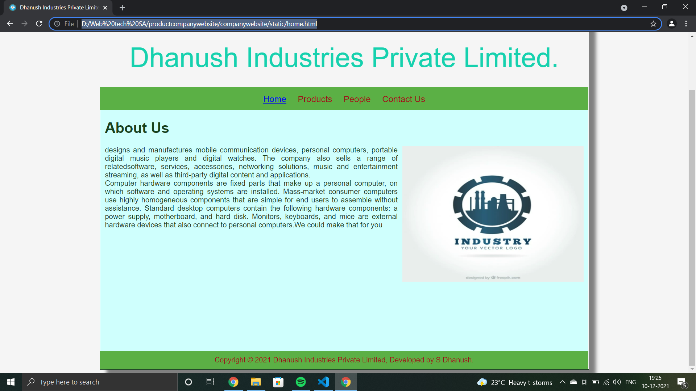
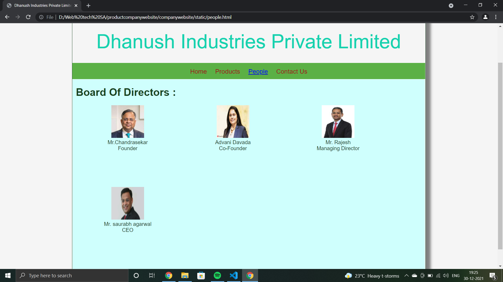
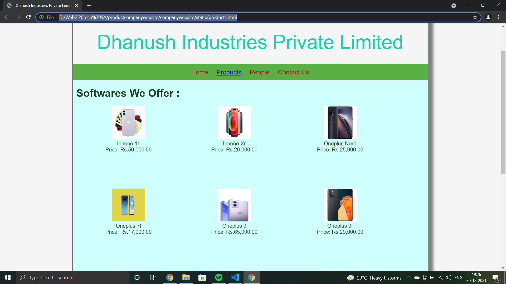
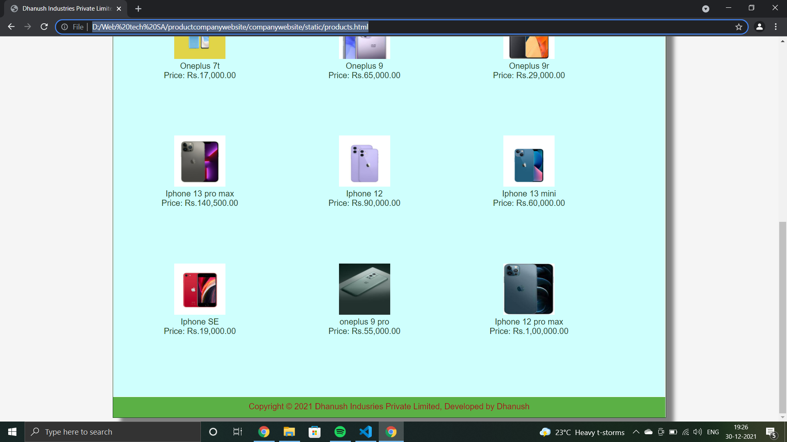
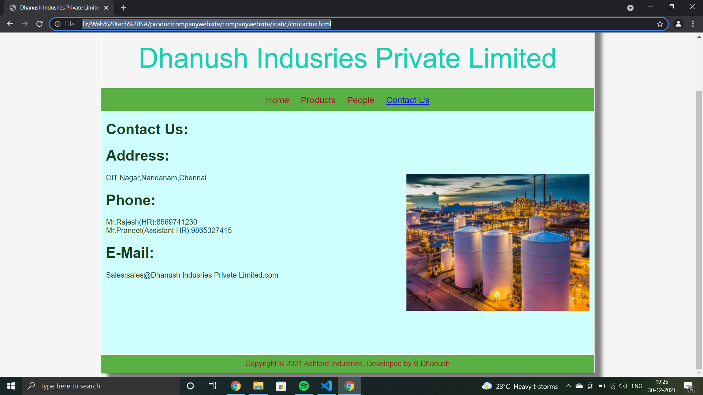

# Web Design for a Software Product Company

## AIM:

To design a static website for a software product company company.

## DESIGN STEPS:

### Step 1:

Requirement collection.

### Step 2:

Creating the layout using HTML and CSS.

### Step 3:

Updating the sample content.

### Step 4:

Choose the appropriate style and color scheme.

### Step 5:

Validate the layout in various browsers.

### Step 6:

Validate the HTML code.

### Step 6:

Publish the website in the given URL.

### PROGRAM :
### HOMEPAGE:
~~~
<!DOCTYPE html>
<html lang="en">
  <head>
    <title>Dhanush Industries Private Limited</title>
    <link rel="stylesheet" href="./css/layout.css" />
    <link rel="icon" href="./img/icon.png" type="image/x-icon" />
  </head>

  <body>
    

      
Dhanush Industries Private Limited.

      

        
<a href="/static/home.html">Home</a>

        
<a href="/static/products.html">Products</a>

        
<a>People</a>

        
<a>Contact Us</a>

      

      

        

          <h1>About Us</h1>
          
          

            designs and manufactures mobile communication devices, personal computers, portable digital music players and digital watches.
             The company also sells a range of relatedsoftware, services, accessories, networking solutions, music and entertainment streaming,
            as well as third-party digital content and applications.
             
            Computer hardware components are fixed parts that make up a personal computer, on which software and operating systems are installed. Mass-market consumer computers use highly homogeneous components that are simple for end users to assemble without assistance. Standard desktop computers contain the following hardware components: a power supply, motherboard, and hard disk.
             Monitors, keyboards, and mice are external hardware devices that also connect to personal computers.We could make that for you
          

        

      

      

        Copyright &#169; 2021 Dhanush Industries Private Limited, Developed by S Dhanush.
      

    

  </body>
</html>
~~~
### Peoplepage:
~~~
<!DOCTYPE html>
<html lang="en">
  <head>
    <title>Dhanush Industries Private Limited</title>
    <link rel="stylesheet" href="./css/layout.css" />
    <link rel="icon" href="./img/ail.png" type="image/x-icon" />
  </head>

  <body>
    

      
Dhanush Industries Private Limited

      

        
<a href="/static/home.html">Home</a>

        
<a href="/static/products.html">Products</a>

        
<a href="/static/people.html">People</a>

        
<a href="/static/contactus.html">Contact Us</a>

      

      

        
    
          <h1>Board Of Directors :</h1>
          

              
 
                  

                  
                  

                  
Mr.Chandrasekar

                  
Founder 

              

              
 
                  

                  
                  

                  
Advani Davada

                  
Co-Founder 

              

              
 
                  

                  
                  

                  
Mr. Rajesh

                  
Managing Director 

              

              
 
                  

                  
                  

                  
Mr. saurabh agarwal

                  
 CEO 

              

          

          
        
      

      

        Copyright &#169; 2021 Ashlord Industries, Developed by S Dhanush
      

    

  </body>
</html>
~~~
### PRODUCT PAGE:
~~~
<!DOCTYPE html>
<html lang="en">
  <head>
    <title>Dhanush Industries Private Limited</title>
    <link rel="stylesheet" href="./css/layout.css" />
    <link rel="icon" href="./img/ail.png" type="image/x-icon" />
  </head>

  <body>
    

      
Dhanush Industries Private Limited

      

        
<a href="/static/home.html">Home</a>

        

          <a href="/static/products.html">Products</a>
        

        
<a href="/static/people.html">People</a>

        
<a href="/static/contactus.html">Contact Us</a>

      

      

        
    
          <h1>Softwares We Offer :</h1>
          

              
 
                  

                  
                  

                  
Iphone 11

                  
Price: Rs.50,000.00 

              

              
 
                  

                  
                  

                  
Iphone Xr

                  
Price: Rs.20,000.00 

              

              
 
                  

                  
                  

                  
Oneplus Nord

                  
Price: Rs.25,000.00 

              

              
 
                  

                  
                  

                  
Oneplus 7t

                  
Price: Rs.17,000.00 

              

              
 
                  

                  
                  

                  
Oneplus 9

                  
Price: Rs.65,000.00 

              

              
 
                  

                  
                  

                  
Oneplus 9r

                  
Price: Rs.29,000.00 

              

              
 
                  

                  
                  

                  
Iphone 13 pro max

                  
Price: Rs.140,500.00 

              

              
 
                  

                  
                  

                  
Iphone 12

                  
Price: Rs.90,000.00 

              

              
 
                  

                  
                  

                  
Iphone 13 mini

                  
Price: Rs.60,000.00 

              

              
 
                  

                  
                  

                  
Iphone SE

                  
Price: Rs.19,000.00 

              

              
 
                  

                  
                  

                  
oneplus 9 pro

                  
Price: Rs.55,000.00 

              

              
 
                  

                  
                  

                  
Iphone 12 pro max

                  
Price: Rs.1,00,000.00 

              

          

          
        
      

      

        Copyright &#169; 2021 Dhanush Indusries Private Limited, Developed by Dhanush
      

    

  </body>
</html>
~~~
### CONTACT PAGE:
~~~
<!DOCTYPE html>
<html lang="en">
  <head>
    <title>Dhanush Indusries Private Limited</title>
    <link rel="stylesheet" href="./css/layout.css" />
    <link rel="icon" href="./img/ail.png" type="image/x-icon" />
  </head>

  <body>
    

      
Dhanush Indusries Private Limited

      

        
<a href="/static/home.html">Home</a>

        
<a href="/static/products.html">Products</a>

        
<a href="/static/people.html">People</a>

        
<a href="/static/contactus.html">Contact Us</a>

      

      

        

          <h1>Contact Us:</h1>
          <h1>Address:</h1>
          
          

            CIT Nagar,Nandanam,Chennai
          

          <h1>Phone:</h1>
          

              Mr.Rajesh(HR):8569741230 
              Mr.Praneet(Assistant HR):9865327415
          

          <h1>E-Mail:</h1>
          

              Sales:sales@Dhanush Indusries Private Limited.com
          

        

      

      

        Copyright &#169; 2021 Ashlord Industries, Developed by S Dhanush
      

    

  </body>
</html>
~~~

## OUTPUT:

### Home Page:

### People Page:

### Product Page:

### ContactUs Page:

## Result:

Thus a website is designed for the software product company and the HTML,CSS code are validated.
